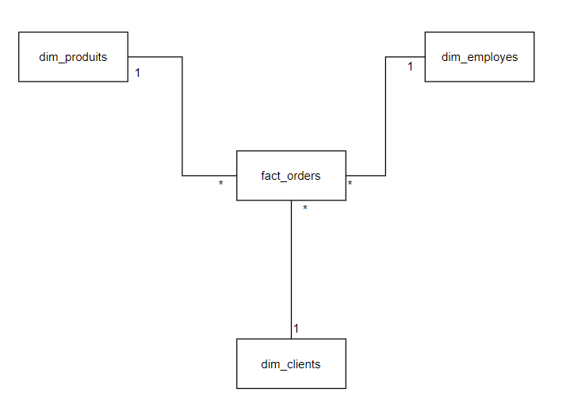

# Creation et alimentation d'un data warehouse en utilisant Airflow 
Configuration de airflow : 
- LocalExecutor
- PostrgreSql MetaDabase
- PostreSql pour le data warehouse

## Modélisation du data Warehouse
Le data warehouse a été modélisé en utilisant la méthodologie de dénormalisation dite du "Star Schema", ci dessous le résultat de la modélisation

## DAG implémenté

Ci dessous, une vue du web server airflow montrant le DAG implémenté pour alimenter le data warehouse

